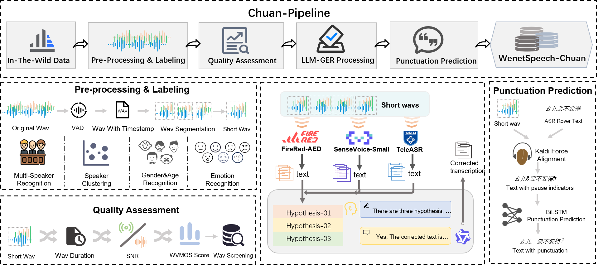

# WenetSpeech-Chuan: A Large-Scale Sichuanese Corpus with Rich Annotation for Dialectal Speech Processing

<p align="center">
  Yuhang Dai<sup>1</sup><sup>,*</sup>, Ziyu Zhang<sup>1</sup><sup>,*</sup>, Shuai Wang<sup>4</sup><sup>,5</sup>, 
  Longhao Li<sup>1</sup>, Zhao Guo<sup>1</sup>, Tianlun Zuo<sup>1</sup>, 
  Shuiyuan Wang<sup>1</sup>, Hongfei Xue<sup>1</sup>, Chengyou Wang<sup>1</sup>, 
  Qing Wang<sup>3</sup>, Xin Xu<sup>2</sup>, Hui Bu<sup>2</sup>, Jie Li<sup>3</sup>, 
  Jian Kang<sup>3</sup>, Binbin Zhang<sup>5</sup>, Lei Xie<sup>1</sup><sup>,╀</sup>
</p>

<p align="center">
  <sup>1</sup> Audio, Speech and Language Processing Group (ASLP@NPU), Northwestern Polytechnical University <br>
  <sup>2</sup> Beijing AISHELL Technology Co., Ltd. <br>
  <sup>3</sup> Institute of Artificial Intelligence (TeleAI), China Telecom <br>
  <sup>4</sup> School of Intelligence Science and Technology, Nanjing University <br>
  <sup>5</sup> WeNet Open Source Community <br>
</p>


<p align="center">
🌐 <a href="https://huggingface.co/spaces/ASLP-lab/WenetSpeech-Chuan"> Huggingface Space</a> &nbsp&nbsp  |   &nbsp&nbsp 🤖 <a href="https://huggingface.co/ASLP-lab/WSChuan-ASR"> ASR Models</a> &nbsp&nbsp   |   &nbsp&nbsp 👨‍💻 <a href="https://huggingface.co/ASLP-lab/WSChuan-TTS"> TTS Models</a>
<br>
📑 <a href="https://arxiv.org/abs/2509.18004">Paper</a> &nbsp&nbsp  |  &nbsp&nbsp 🎤 <a href="https://aslp-lab.github.io/WenetSpeech-Chuan/">Demo Page</a> &nbsp&nbsp | &nbsp&nbsp 💬 <a href="https://github.com/llh666521/WenetSpeech-Yue?tab=readme-ov-file#contact">Contact Us</a>&nbsp&nbsp 
</p>

This is the official repository 👑 for the WenetSpeech-Chuan dataset and the source code for Chuan-Pipe speech data preprocessing pipeline.

<p align="center">
    
</p>

## Download
* The WenetSpeech-Chuan dataset is available at [WenetSpeech-Chuan](https://huggingface.co/datasets/ASLP-lab/WSChuan-Train).
* The WSChuan-eval benchmark is available at [WSChuan-ASR-eval](https://huggingface.co/datasets/ASLP-lab/WSChuan-Eval) and [WSChuan-TTS-eval](https://huggingface.co/datasets/ASLP-lab/WSChuan-Eval).
* The ASR models are available at [WSChuan-ASR](https://huggingface.co/ASLP-lab/WSChuan-ASR).
* The TTS models are available at [WSChuan-TTS](https://huggingface.co/ASLP-lab/WSChuan-TTS).

## ASR Leaderboard
#### Leaderboard shows ASR Results (CER%) on Sichuanese Datasets.
*Note: **Bold** indicates best performance, <u>underlined</u> indicates second-best performance, and <span style="background-color: #d4edda; padding: 0 2px;">light green background</span> indicates models finetuned on a high-quality internal corpus (to show the system's potential as a foundation model).*

| Model | Model Size | WSC-Eval-ASR - Easy | WSC-Eval-ASR - Hard | WSC-Eval-ASR - Total | Magicdata - Conversation | Magicdata - Daily-Use | Avg. |
| --- | --- | --- | --- | --- | --- | --- | --- |
| **with LLM** |  |  |  |  |  |  |  |
| Kimi-Audio<sup></sup> | 7B | 16.65 | 28.66 | 17.66 | 24.67 | **5.77** | 18.68 |
| FireRedASR-LLM<sup></sup> | 8.3B | 12.80 | 25.27 | 14.40 | 17.68 | 6.69 | 15.37 |
| Qwen2.5-omni<sup></sup> | 3B | 16.94 | 26.01 | 18.20 | 20.40 | 6.32 | 17.69 |
| Qwen2.5-omni-WSC-Finetune⭐ | 3B | 14.36 | 24.14 | 15.61 | 18.45 | 6.15 | 15.74 |
| <span style="background-color: #d4edda; padding: 0 2px;">Qwen2.5-omni+internal data⭐</span> | 3B | 13.17 | 23.36 | 14.81 | 18.50 | 5.88 | 15.14 |
| <span style="background-color: #d4edda; padding: 0 2px;">Qwen2.5-omni-WSC-Finetune + internal data⭐</span> | 3B | 12.93 | 23.19 | 14.25 | 17.95 | <u>5.89</u> | 14.84 |
| **without LLM** |  |  |  |  |  |  |  |
| SenseVoice-small<sup></sup> | 234M | 17.43 | 28.38 | 18.39 | 23.50 | 8.77 | 19.29 |
| Whisper<sup></sup> | 244M | 52.06 | 63.99 | 53.59 | 55.88 | 52.03 | 55.51 |
| FireRedASR-AED<sup></sup> | 1.1B | 13.29 | 23.64 | 14.62 | 17.84 | 6.69 | 15.14 |
| Paraformer<sup></sup> | 220M | 14.34 | 24.61 | 15.66 | 19.81 | 8.16 | 16.52 |
| Paraformer-WSC-Finetune⭐ | 220M | 12.15 | 22.60 | 13.51 | 16.60 | 8.02 | 14.58 |
| <span style="background-color: #d4edda; padding: 0 2px;">Paraformer + internal data⭐</span> | 220M | <u>11.93</u> | <u>21.82</u> | <u>13.14</u> | <u>15.61</u> | 6.77 | <u>13.85</u> |
| <span style="background-color: #d4edda; padding: 0 2px;">Paraformer-WSC-Finetune + internal data</span>⭐ | 220M | **11.59** | **21.59** | **12.87** | **14.59** | 6.28 | **13.38** |

## TTS Evaluation
*Note: **Bold** indicates best performance, <u>underlined</u> indicates second-best performance, and <span style="background-color: #d4edda; padding: 0 2px;">light green background</span> indicates models models trained on WenetSpeech-Chuan or additionally finetuned on an internal high-quality dataset.*

#### TTS Results on WSC-Eval-TTS-easy.
| Model | CER(%)↓ | SIM(%)↑ | IMOS↑ | SMOS↑ | AMOS↑ |
| --- | --- | --- | --- | --- | --- |
| Step-Audio-TTS | 10.83 | 67.66 | 3.81 | 2.86 | 3.15 |
|CosyVoice 2.0 |	7.14|	70.27|	3.88|	3.10	|3.69|
|Qwen-TTS	|4.13|-	|3.95	|-|	3.90|
|<span style="background-color: #d4edda; padding: 0 2px;">CosyVoice2-WSC	|4.28	|72.78|	**4.13**|	3.94	|4.05|
|<span style="background-color: #d4edda; padding: 0 2px;">CosyVoice2-WSC-SFT|	**4.08**	|**78.84**	|4.10	|**4.16**|	**4.20**|

#### TTS Results on WSC-Eval-TTS-hard.
| Model | CER(%)↓ | SIM(%)↑ | IMOS↑ | SMOS↑ | AMOS↑ |
| --- | --- | --- | --- | --- | --- |
| Step-Audio-TTS | 12.52|	54.52	|3.75	|2.77|	3.06 |
|CosyVoice 2.0 |	9.06	|60.10	|3.96	|2.73|	3.81|
|Qwen-TTS	|7.35|	-|	**4.02**|	-|	3.88|
|<span style="background-color: #d4edda; padding: 0 2px;">CosyVoice2-WSC	|8.78|	62.59|	3.85|	2.78	|3.92|
|<span style="background-color: #d4edda; padding: 0 2px;">CosyVoice2-WSC-SFT|	**7.22**|	**67.96**|	4.01|	**3.03**	|**3.98**|


---

## WenetSpeech-Chuan Overview
* Contains 10,000 hours of large-scale Chuan-Yu dialect speech corpus with rich annotations, the largest open-source resource for Chuan-Yu dialect speech research.
* Stores metadata in a single JSON file, including audio path, duration, text confidence, speaker identity, SNR, DNSMOS, age, gender, and character-level timestamps. Additional metadata tags may be added in the future.
* Covers ten domains: Short videos, Entertainment, Live streams, Documentary, Audiobook, Drama, Interview, News and others.
<div align="center"></div>

## Benchmark
To address the unique linguistic characteristics of Chuan-Yu dialect, we propose WSChuan-eval, a comprehensive benchmark encompassing both Automatic Speech Recognition (ASR) and Text-to-Speech (TTS) tasks.

### ASR Benchmark
We introduce WSC-Eval-ASR, a test set developed for Automatic Speech Recognition (ASR) as a key task in speech understanding. It features **multi-round manual annotations** including text transcripts, emotion, age, and gender labels. The set is divided into Easy and Hard subsets by the source domain and acoustic environment.

| Set   |              Main domain          | Hours (h) |
|-------|-----------------------------------|-----------|
| Easy  |          audio book, reading      |    8.55   |
| Hard  | hort videos, entertainment, drama |    1.15   |

### TTS Benchmark
We introduce WSChuan-TTS-eval, which is a standardized test set constructed to address the lack of standardized benchmarks for Sichuanese dialects Text-to-Speech (TTS). It comprises two subsets: 
- WSC-Eval-TTS-easy, which contains sentences with dialectal words covering various domains;  
- WSC-Eval-TTS-hard, which includes long sentences and sentences of diverse styles (e.g., tongue twisters, folk sayings, emotional speech) generated by Large Language Models (LLMs). 

For audio prompts, 10 speakers (5 male and 5 female) are selected from MagicData and internal recordings, with each speaker recording 200 sentences to ensure balance in gender, age, and accent variations.
## Chuan-Pipeline
Chuan-Pipe Overview:
<div align="center"></div>

### Audio Collection
Chuan-Pipeilne collects large-scale, in-the-wild speech recordings across diverse domains such as storytelling, drama, commentary, vlogs, food, entertainment, news, and education. These long recordings are segmented into short clips with VAD, yielding utterance-level data for transcription and quality evaluation.

### Pre-processing and Labeling
The initial stage of the pipeline focuses on data acquisition, segmentation, and the enrichment of speech segments with multi-dimensional paralinguistic labels. Raw data acquisition begins with mining metadata from online video platforms to identify content potentially containing Sichuanese dialects. Following an initial manual verification to confirm the presence of the target dialect, the acquired audio streams undergo a multi-stage workflow:


**VAD & Segmentation**: Long audio streams are segmented into 5-25 second clips using Voice Activity Detection (VAD), removing non-speech portions like silence and noise.

**Single-Speaker Selection & Clustering**: We first employ the [pyannote toolkit](https://github.com/pyannote) to isolate single-speaker segments. Subsequently, speaker embeddings are extracted with the CAM++ model and clustered to assign a consistent speaker ID to all utterances from a single individual.

**Paralinguistic Annotation**: Speaker gender is identified using a pre-trained [classifier](https://github.com/JaesungHuh/voice-gender-classifier) (98.7\% accuracy). Age is estimated via the Vox-Profile [benchmark](https://github.com/tiantiaf0627/vox-profile-release) and categorized into age stages(children, teenager, young, middle-aged, old). Emotion is labeled by a majority vote over predictions from Emotion2vec~\cite{ma2023emotion2vec} and [SenseVoice](https://github.com/plexormedia/sensevoice), covering seven categories (happy, angry, sad, neutral, fearful, surprised, and disgusted).


### Speech Quality Annotation
To support high-fidelity tasks such as TTS and voice conversion, WenetSpeech-Pipe integrates a comprehensive quality assessment stage. Each segment is evaluated by (i) [Brouhaha](https://github.com/marianne-m/brouhaha-vad) for signal-to-noise ratio (SNR), (ii) [DNSMOS](https://github.com/microsoft/DNS-Challenge) for perceptual quality (MOS), and (iii) bandwidth detection for spectral coverage. These complementary measures yield structured annotations with quantitative scores and spectral references.
<div align="center"></div>

### Automatic Speech Recognition
We select three models with the best performance on Cantonese to perform multi-system labeling: SenseVoice, TeleASR, and FireRed-ASR. For each audio file, we obtain the corresponding multi-system transcriptions.

### LLM Generative Error Correction based ROVER (LLM-GER)
To enhance the accuracy of automatic speech recognition (ASR) transcriptions, building upon prior research ([GER](https://arxiv.org/pdf/2507.09116), [MMGER](https://arxiv.org/abs/2405.03152)), we propose a robust ASR transcription framework tailored for the Sichuanese dialects. Our approach, termed **LLM** **G**enerative **E**rror Correction based **R**OVER (**LLM-GER**), aims to merge outputs from multiple ASR systems into a single accurate and reliable transcription. First, three different ASR systems (FireRed-ASR, SenseVoice-Small, and TeleASR) produce initial candidate transcriptions. These are then merged by **Qwen3**, which leverages its strong dialectal understanding and our carefully designed prompt to perform error correction without altering the original semantics or token length.  Finally, transcription confidence is calculated based on the four transcriptions, as detailed in Figure below.


<div align="center"></div>

The prompt is presented in the figure below:

<div align="center"></div>

## Contributors
|  |  |  |  |  |
| ---- | ---- | ---- | ---- | ---- |


## Citation
Please cite our paper if you find this work useful:
```
@misc{dai2025wenetspeechchuan,
  title = {WenetSpeech-Chuan: A Large-Scale Sichuanese Corpus with Rich Annotation for Dialectal Speech Processing},
  author = {Yuhang Dai and Ziyu Zhang and Shuai Wang and Longhao Li and Zhao Guo and Tianlun Zuo and Shuiyuan Wang and Hongfei Xue and Chengyou Wang and Qing Wang and Xin Xu and Hui Bu and Jie Li and Jian Kang and Binbin Zhang and Lei Xie},
  year = {2025},
  eprint = {2509.18004},
  archivePrefix = {arXiv},
  primaryClass = {cs.CL},
  url = {https://arxiv.org/abs/2509.18004}
}

```


## Contact
If you are interested in leaving a message to our research team, feel free to email yhdai@mail.nwpu.edu.cn or ziyu_zhang@mail.nwpu.edu.cn.
<p align="center">

<br>
<em>Scan to join our WeChat discussion group</em>
<br>
</p>
<p align="center">
    
</p